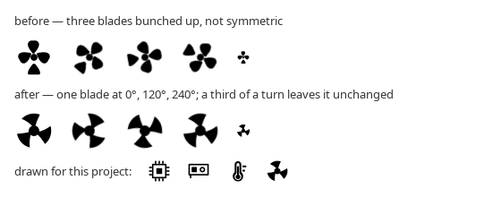

# 01 — Fans: what was wrong, and what was not

Three complaints: not every fan appears, the icon is broken, the
animation does not work. They have three different answers.

## "Not all fans appear" — the kernel only has one

Established in `00`: `/sys/class/hwmon` carries a single `fan1_input`,
KSystemStats reports a single RPM sensor, and the motherboard's Super I/O
chip has no driver loaded. The gadget was showing everything there was.

What *was* wrong is the way the catalogue decided what counts as a fan.
It first narrowed the sensor tree by matching ids against a list of
words — `temp`, `therm`, `fan`, `rpm`, `hotspot`, `junction`, `edge`,
`composite`, `lmsensors/` — and only then looked at units. That is a
guess about how drivers spell things: a fan whose id contains none of
those words does not exist as far as the gadget is concerned, and no
amount of correct hardware would make it appear.

The catalogue now asks every real sensor for its unit and believes the
answer: **1004 is a fan, 1000 is a temperature**, nothing else decides.
Template rows in the tree (`disk/(?!all).*​/free`, `gpu/gpu\d+/name`) are
recognised by carrying regular-expression syntax, which no real id does —
the previous test looked for the two characters `\d` and therefore missed
every template written the other way.

The settings now say why a machine reports fewer fans than it has, rather
than leaving an empty list to speak for itself.

## "The RPM does not update" — the subscription never happened

This is the real defect, and it is the same one as `02`: the sensor list
was handed to a disabled `SensorDataModel`, which silently keeps it and
never subscribes. A fan card created off screen therefore showed `—` for
ever. Full diagnosis and fix in `02`; both gadgets go through the shared
`SensorSubscription` now.

Measured in plasmashell after the fix, with the card scrolled into view
at t=8 s:

```
t=6  active=false shown=1 values=0 rpm=-1  sub=[Waiting for readings]
t=10 active=true  shown=1 values=1 rpm=0   sub=[0 fans turning]
t=22 active=false shown=1 values=1 rpm=0   (scrolled away — value kept)
t=30 active=true  shown=1 values=1 rpm=0   (scrolled back — still there)
```

Three states are now distinct, where the old card had two:

| state | shown as |
|---|---|
| no reading yet | `—`, dimmed icon, *"Waiting for a reading"* |
| stopped | `0 RPM`, still icon |
| turning | `1.245 RPM`, spinning icon, bar against the reported maximum |

"No reading" and "stopped" were previously the same thing, which is why
a fan at 0 RPM and a fan that had not answered looked identical.

## "The icon is broken" — it was

The 16 px fan glyph was drawn as three blades clustered in the upper half
with a stub at the bottom. At row size it reads as a club (♣), and
because it is not symmetric under a third of a turn, rotating it wobbles.



It is redrawn from one blade repeated at exactly 120° and 240° about the
centre of the 16 px grid, each blade swept back and meeting a hub that
joins them into one rotor. Being unchanged by a third of a turn, it spins
without wobble. Verified at 16, 22, 32, 48 and 64 px and at seven
rotations, then in the running shell, where it also confirmed that the
mask tint applies (the offscreen harness cannot show tinting — it runs
without the KDE platform theme).

## "The animation does not work"

It never ran, because the fan reports 0 RPM and the animation is
deliberately gated on `RPM > 0`. That is correct behaviour, and with the
subscription fixed the gadget now *says* 0 RPM instead of `—`, so the
still icon is explained.

The gate is unchanged and still four-fold: the card is on screen, some
fan is actually turning, the system has animations on
(`Kirigami.Units.longDuration > 0`), and the user has not switched
*Animate fan icons* off. One timer at 80 ms serves every icon; speed
scales each icon's rotation by its own RPM against the maximum the
hardware reports.

## Layout

Drive Info's language, so the two cards read as one product: an icon, the
name in demi-bold, a line of detail (the card or chip the fan belongs
to), and a thin bar — here the speed against the maximum the sensor
reports, and nothing at all when it reports no maximum, because a bar
without a scale is decoration. The reading sits at the right in monospace
and the list leaves room for the scrollbar rather than letting it sit on
top of the figure.

## Status

| | |
|---|---|
| all fans KSystemStats exposes appear | **TESTED ON REAL HARDWARE** (1 fan) |
| discovery independent of sensor names | **TESTED ON REAL HARDWARE** (classification by unit) |
| RPM updates | **TESTED ON REAL HARDWARE** |
| 0 RPM distinguished from no reading | **TESTED ON REAL HARDWARE** |
| icon correct and symmetric | **TESTED ON REAL HARDWARE** |
| a turning fan spins | **NOT TESTED** — no reachable machine reported RPM > 0 |
| empty state | **TESTED ON VM** (no fans at all) |
