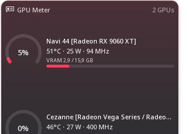

# 04 — GPU Meter: density instead of scrolling

## The report

> My machine has two GPUs. I do not want a vertical scrollbar for two
> GPUs.

## What it did

Each card had a fixed shape — a large ring gauge beside the name, then a
line each for temperature, power and clock, then the VRAM label and bar —
and the delegate took `max(implicitHeight, listHeight / count)`. With two
cards that shape does not fit a 2x1 card, so the list scrolled. The
layout had one idea of how a GPU looks and made the container cope.

## What it does

The density is chosen from the height each card actually gets:

```qml
slotHeight = (height - spacing * (count - 1)) / count
density    = slotHeight >= 7.5 gridUnits ? roomy
           : slotHeight >= 4.0 gridUnits ? compact : dense
```

| density | ring | text |
|---|---|---|
| roomy | large, with "GPU 0" under the figure | name on up to two lines, one line per figure, VRAM label and bar |
| compact | 3.4 gu | name, then temperature · power · clock on one line, VRAM label and bar |
| dense | 2.4 gu | name, then everything on one line, bar only |

Scrolling happens when even `dense` does not fit — `max(minCardHeight,
slotHeight)` — rather than being the first answer. A machine with eight
cards still scrolls; a machine with two no longer pays for it.

Keying on height rather than on the number of GPUs means the same rule
covers a second case the report did not mention: one GPU on a 1x1 card
gets the compact layout instead of a ring with no room for the text.

Nothing is hidden silently. Whatever a density leaves out is in the
card's tooltip and in its accessible name, both of which carry the full
name plus every figure.

## On this machine

```
GPU Meter                                   2 GPUs
 (4%)  Navi 44 [Radeon RX 9060 XT]
       49°C · 21 W · 53 MHz
       VRAM 2,8 / 15,9 GB   ▃▃▃───────────
 (0%)  Cezanne [Radeon Vega Series …]
       40°C · 29 W · 400 MHz
       VRAM 0,0 / 0,5 GB    ▁─────────────
```

Both cards complete, no vertical scrollbar.



## Two fixes that came with it

- **Power was missing.** amdgpu answers `gpu/gpuN/power` with nothing and
  reports the board's draw as `gpu/gpuN/power1` (PPT). Measured: `power`
  undefined, `power1` 21 W and 29 W. The gadget takes whichever has a
  figure, so Intel and NVIDIA keep working and AMD gains the reading it
  always had.
- **A machine with no GPU showed "GPU 0".** The initial value was
  `["gpu/gpu0"]`, a card assumed before discovery ran. It starts empty
  and has an empty state now.

Cards are named by `gpu/gpuN/name`, never by position — "gpu0 is the
integrated one" is not true in general, and on this machine it is false:
gpu0 is the discrete RX 9060 XT.

## Status

| | |
|---|---|
| 1 GPU → roomy layout | **TESTED ON REAL HARDWARE** (1x1 and wider) |
| 2 GPUs → both visible, no scroll | **TESTED ON REAL HARDWARE** |
| 3+ GPUs → denser | **NOT TESTED** — no such machine; the rule is the same arithmetic |
| many GPUs → scroll | **NOT TESTED** |
| Intel / NVIDIA discovery | **NOT TESTED** — only AMD here; nothing vendor-specific was added |
| power from `power1` | **TESTED ON REAL HARDWARE** |
