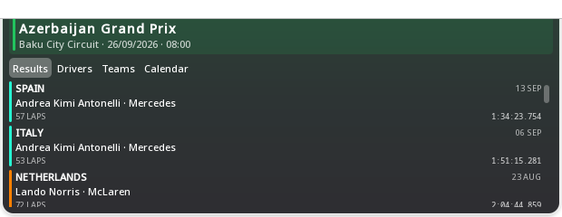

# 05 — Live Scores: settings that fit, and a Formula 1 of its own

## Part one: Configure Live Scores

### The report

> It still has information that does not fit properly. Enough spot fixes
> — rebuild the layout so it works at any window size and any scale.

### Two faults, one symptom

**The dialog never gave the page its width.** `GadgetSettingsDialog`
handed the settings page a width only from `onWidthChanged`:

```qml
Item {
    id: settingsHolder
    width: parent ? parent.width : 0
    onWidthChanged: if (dialog.settingsItem) dialog.settingsItem.width = width
}
```

That fires once, when the holder goes from 0 to its width. The first page
ever opened in a session got a width; every page after it was created
into a holder whose width no longer changed, and got none. Measured with
the Live Scores page: `itemW = 0`. At width 0 every wrapping label breaks
to one word per line, the page reports an implicit height of several
hundred pixels, and the dialog — which sizes itself from that — collapses
to a sliver around it.

The dialog now hands the page its width when it creates it, and sizes its
scrolling area from what the popup actually offers rather than a fixed
22-grid-unit cap, so it follows the interface scale. Both figures are
clamped: an applet that is not on screen has a parent of width 0, which
used to produce a *negative* dialog width (observed: −54).

After the fix, with 17 competitions:

```
dialog h=513   scroll area=420   page content=766   → scrolls
```

**The competition list was a width-dependent grid.** Its column count was
chosen from the dialog's width (three, two or one), which is fragile in
exactly the conditions the report names: a larger interface scale, a
longer translation, a small popup. One vertical column cannot do that —
it only ever gets taller, and the dialog scrolls.

### The new page

```
Follow competitions
  ☑  ⚽  Brasileirão Série A          Soccer
  ☑  ⚽  Champions League             Soccer
  ☐  ⚽  Europa League                Soccer
  …
  ☐  🏎️  Formula 1                   Motorsport
  ─────────────────────────────────────────────
  Refresh live scores
  [ Every minute            ▾ ]
  Notifications
  [ ●— ] Announce kick-off, goals and full time
  ─────────────────────────────────────────────
  Alerts only arrive while this page is open …
  Football, basketball and the rest: TheSportsDB. Formula 1: …
  Fixtures refresh every 30 minutes …
```

Each competition is a full-width row that is itself the click target, not
a checkbox with a label beside it. Labels sit above their controls rather
than beside them, so a long translation lengthens the dialog instead of
squeezing the control off the edge. The provider and notification notes
moved to a footer, under everything actionable. Nothing scrolls inside
the dialog's own scrolling area.

## Part two: Formula 1

### Why it needed its own everything

A grand prix has no home side, no away side and no running score, so the
match row said nothing useful about it. Worse, the championship was
simply absent: TheSportsDB answers

```
GET …/lookuptable.php?l=4370&s=2026   →   (empty document)
```

so there were no standings to show at all. Its Motorsport fixtures are
session-level (*"Azerbaijan Grand Prix Practice 1"*), which is a weekend
timetable, not a season.

### The source

`lib/Formula1Provider.js`, on the Ergast API as continued by
**jolpica-f1** (`https://api.jolpi.ca/ergast/f1/`) — the community
successor to Ergast, which retired at the end of 2024. Free, no key, and
it answers the five questions directly. Verified from this machine before
a line of UI was written:

| endpoint | answer |
|---|---|
| `current/results/1.json` | 14 rounds run, each with its winner, laps and time |
| `current/driverstandings.json` | 1 Antonelli 292 (Mercedes), 2 Russell 211, 3 Hamilton 191 |
| `current/constructorstandings.json` | 1 Mercedes 503, 2 Ferrari 358, 3 McLaren 306 |
| `current.json` | 23 rounds with dates, countries, circuits |
| `current/next.json` | round 15, Azerbaijan, 26/09 11:00 Z, with session times |

Nothing is scraped from formula1.com — a page layout is not an interface
and a scraper breaks silently on the first redesign. No season is written
into the code: `current` is whatever the API resolves it to. Position 1
only is requested for results, so the whole season's winners arrive in
one small answer instead of every classified car of every race.

### The view

A standing next-race strip over four tabs:

```
NEXT RACE · ROUND 15
Azerbaijan Grand Prix
Baku City Circuit · 26/09/2026 · 08:00        ← the viewer's own time zone

[Results] [Drivers] [Teams] [Calendar]

▌SPAIN                                 13 SEP
 Andrea Kimi Antonelli · Mercedes
 57 LAPS                          1:34:23.754
▌ITALY                                 06 SEP
 …
```

- **Results** — each round with the country, the date, the winner and
  their team, the laps and the race time, most recent first, with a bar
  in the winning team's colour.
- **Drivers** — position, name (the three-letter code plus surname on a
  narrow card), the flag of the driver's nationality, the team, and the
  points with a `PTS` label under them.
- **Teams** — position, name, a bar showing the share of the leader's
  total in the team's colour, and the points.
- **Calendar** — grouped by month, each round marked done (`✓`, dimmed),
  **NEXT** (in the accent colour, with the word, not only the colour), or
  still ahead.

Team colour and the flag of a nationality carry the identity; there are
no remote images, so nothing about the layout depends on a picture
loading. A constructor this file does not know simply gets the accent
colour.

The weekend's sessions — practice, sprint, qualifying — are in the
next-race tooltip, in local time, and only the ones the API carries for
that event.

Everything is cached in the gadget's shared cache: standings and results
for 30 minutes, the calendar for 12 hours. Switching tabs costs nothing.
While a motorsport competition is selected, the match plumbing does not
run at all — including its fetches.



## Status

| | |
|---|---|
| settings fit in a small popup | **TESTED ON REAL HARDWARE** (h=513 over 766 of content) |
| every competition reachable | **TESTED ON REAL HARDWARE** |
| interface scale 125–200 % | **NOT TESTED** — the fixed cap that broke it is gone and sizing is in grid units |
| F1 results / drivers / teams / calendar | **TESTED ON REAL HARDWARE**, live data |
| next race with local time | **TESTED ON REAL HARDWARE** |
| offline and API error states | **NOT TESTED** against a real outage; the paths are the shared `GadgetNet` ones |
| no fetches while another competition is selected | **TESTED ON REAL HARDWARE** (guard at the top of `load` and `refreshIfStale`) |
