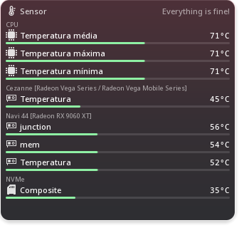

# 07 — One visual language, and what it says out loud

## The shared shape

Drive Info was taken as the reference, as instructed, and Sensor, Fans
and GPU Meter were rebuilt to the same grammar rather than copied from
it:

```
[icon]  Name in demi-bold                          figure
        a line of detail, dimmed
        ▃▃▃▃▃▃▃▃▃▃▃▃──────────────────────
```

| | icon | name | detail line | bar |
|---|---|---|---|---|
| Drive Info | device icon from Solid | volume label | *"292 GiB free of 931 GiB"* | share used |
| Sensor | kind of hardware | sensor's short name | the verdict in words | position between cool and critical |
| Fans | fan glyph | fan's short name | the card or chip it belongs to | speed against the reported maximum |
| GPU Meter | ring gauge | card's own name | temperature · power · clock | VRAM used |

Same spacing (`Kirigami.Units.smallSpacing` between rows, 2 px inside
one), same weights, same opacities (0.85 for an icon, 0.7 for a detail
line, 0.55 for a group heading), same bar (0.8 × smallSpacing tall,
rounded, 12 % track). A list only shows a scrollbar when it has
something to scroll, and now leaves room for it instead of letting it sit
on the reading.



## Icons

Every icon is symbolic and drawn as a mask so it takes the theme's text
colour. Where Breeze had nothing usable, the glyph is drawn for this
project rather than approximated:

| use | icon | where from |
|---|---|---|
| CPU | `cpu-symbolic` | **ours** — Breeze has a 64 px coloured `cpu` and a settings icon |
| GPU | `gpu-symbolic` | **ours** — Breeze's only GPU glyph means "desktop effects" |
| temperature | `temperature-symbolic` | **ours** — Breeze's is a symlink to the coloured icon and collapses to a square as a mask |
| fan | `fan-symbolic` | **ours** — no theme ships one |
| NVMe | `media-flash-symbolic` | Breeze |
| drive | `drive-harddisk-symbolic` | Breeze |
| board / unknown | `computer-symbolic` | Breeze |
| power, clock | `flash-symbolic`, `speedometer-symbolic` | Breeze |

Two names in the previous stage pointed at icons that do not exist —
`cpu-symbolic` and `battery-charging-symbolic` — and silently fell back.
Every name above was checked on disk.

## Colour is never the only channel

| | colour | also |
|---|---|---|
| temperature band | blue → green → yellow → orange → red | the verdict in words on the row, in the tooltip and in the accessible name |
| fan turning | accent vs. dimmed | `0 RPM` / `1.245 RPM` / `—` as text, and the icon stops |
| F1 calendar | accent for the next race | the word **NEXT**, and `✓` for a race already run |
| GPU load | ring fills, red above 90 % | the percentage as a number |
| Do Not Disturb | neutral colour | the sentence *"Do Not Disturb is on — the pop-up is hidden."* |

## Accessibility

Every row added or rebuilt in this stage carries a role and a name that
reads as a sentence:

| | `Accessible.name` |
|---|---|
| Sensor row | *"Navi 44 junction, 56°C, Normal temperature"* — or *"…, waiting for a reading"* |
| Fan row | *"Ventoinha 1, 0 RPM"* / *"…, stopped"* / *"…, waiting for a reading"* |
| GPU card | *"Navi 44 [Radeon RX 9060 XT], 5% used. 51°C · 25 W · 94 MHz · VRAM 2,9 / 15,9 GB"* |
| F1 result | *"Spanish Grand Prix, won by Andrea Kimi Antonelli of Mercedes"* |
| F1 driver | *"1. Andrea Kimi Antonelli, Mercedes, 292 points"* |
| F1 calendar | *"Round 15, Azerbaijan Grand Prix, 26/09/2026"* |
| competition row | the competition's name, with its checked state |
| Gallery arrows | *"Previous picture"* / *"Next picture"*, plus tooltips |

Group headings are `Accessible.Heading`; the spinning fan icon is
`Accessible.ignored` because the row already says the speed; a
competition row is an `Accessible.CheckBox` with the whole row as its
target.

**Not tested:** no screen-reader session was run (no Orca on either
machine). These are properties verified in the source and in the engine,
not through AT-SPI.

## Internationalisation

Source strings are English and go through `i18n`, `i18nc`, `i18np` or
`i18ncp`. The kit's audit over the whole gadget tree:

```
16. INTERNATIONALISATION — visible literals without i18n
  -> 0 untranslated visible literal(s)
```

Rules followed by the new strings:

- context wherever a short string is ambiguous — `"@info a fan that is
  not turning", "0 RPM"`, `"@label championship points, abbreviated",
  "PTS"`, `"@title:tab constructors' championship", "Teams"`;
- plurals through `i18ncp` — *"%1 fan turning"* / *"%1 fans turning"*,
  *"%1 LAP"* / *"%1 LAPS"*;
- numbers through `toLocaleString(Qt.locale(), …)` — temperatures, RPM,
  points, VRAM;
- dates and times through `Qt.formatDate`/`formatTime` with the
  viewer's locale and time zone, which is what puts the Azerbaijan race
  at 08:00 here rather than 11:00 Z;
- names a daemon already localises are used as they arrive —
  KSystemStats gives *"Temperatura média"* and *"Ventoinha 1"* on this
  system, and nothing re-translates them.

Labels sit above their controls in the rebuilt settings page, so a longer
translation makes the dialog taller rather than pushing a control off the
edge — the failure mode the Live Scores grid had.

## Progressive disclosure

Nothing important is hidden, and nothing unimportant shouts:

- the GPU card drops lines as space shrinks, and everything dropped is in
  the tooltip and the accessible name;
- the Sensor row drops its verdict line at 1x1, keeping it in the
  tooltip;
- the F1 weekend's session times live in the next-race tooltip;
- group headings appear only when there is more than one group;
- a bar is drawn only when the hardware supplies a scale for it — a fan
  with no reported maximum gets no bar rather than an invented one.
