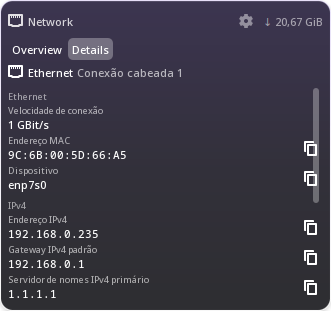

# 11 — Network → Details: fourteen rows of nothing

## The report

> In Network, on the Details tab where Ethernet should appear, the speed,
> the MAC address, the device, the IPv4 address, gateway and DNS servers,
> and the same fields for IPv6, are not showing.

## What was on screen

The heading was right — *"Ethernet · Conexão cabeada 1"* — and the list
below it was empty, with a scrollbar suggesting content that would not
draw. So the panel had found the correct connection and then failed to
render a single row of it.

## The cause

The rows come from plasma-nm's `ConnectionDetailsModel`, reached through
`NetworkModel`'s `ConnectionDetailsModelRole`. The delegate read them by
role name:

```qml
required property var model
readonly property bool isSection: model.IsSection === true
readonly property string label: isSection ? model.SectionTitle : model.DetailLabel
```

**`ConnectionDetailsModel` does not publish role names to QML.** Measured
side by side on the live connection:

```
[1] BY NAME:   IsSection=undefined SectionTitle=undefined DetailLabel=undefined DetailValue=undefined
[1] BY NUMBER: 257=false  259=Velocidade de conexão  260=1 GBit/s
[2] BY NAME:   IsSection=undefined …
[2] BY NUMBER: 257=false  259=Endereço MAC  260=9C:6B:00:5D:66:A5
```

Every field was `undefined`, so `isSection` was false, the label and the
value were empty strings, and fourteen rows drew fourteen blank lines.
The data had been there the whole time.

This is also why the lab VM "passed" in stage 2: that check counted the
model's rows and read them by number in the probe, never through the
delegate that the user actually sees.

## The fix

The rows are read once, by numeric role, into plain objects:

```qml
readonly property int roleIsSection: 257      // Qt::UserRole + 1 …
readonly property int roleSectionTitle: 258
readonly property int roleDetailLabel: 259
readonly property int roleDetailValue: 260
```

`rebuildRows()` runs when the details model changes and on that model's
own `dataChanged` / `rowsInserted` / `rowsRemoved` / `modelReset`, and the
list takes a JS array. A row whose label and value are both empty is
skipped rather than drawn.

Magic numbers are a liability, so the failure is made visible: if the
model has rows but none of them yields a label or a value,
`rolesUnreadable` is true and the panel says *"This version of the
network service reports its details in a way this gadget does not
understand."* — instead of the blank list that hid this bug for a whole
stage.

## Two more faults found on the way

Both come from this machine having **four active connections** — the
wired link plus three Docker bridges — where the VM had one.

- **The resolved primary connection was thrown away continuously.** The
  rescan timer began with `primaryPath = ""` and was restarted from
  `onDataChanged`, which `NetworkModel` emits constantly for rates and
  signal levels. So the D-Bus answer was discarded within 400 ms of
  arriving, every time, and the panel fell back to "the first candidate".
  The active set is now fingerprinted by connection path, and the
  resolved primary is kept until that set actually changes.
- **The fallback could pick a Docker bridge.** "First candidate" was
  model order. Candidates are now ordered by what they are — wired and
  Wi-Fi first, mobile next, bridges, tunnels, VLANs and bonds last — so
  the guess before D-Bus answers is a real uplink, and so is the answer
  if D-Bus never comes.

## Result

```
Ethernet · Conexão cabeada 1
  Ethernet
    Velocidade de conexão      1 GBit/s
    Endereço MAC               9C:6B:00:5D:66:A5        ⧉
    Dispositivo                enp7s0                   ⧉
  IPv4
    Endereço IPv4              192.168.0.235            ⧉
    Gateway IPv4 padrão        192.168.0.1              ⧉
    Servidor de nomes IPv4 primário    1.1.1.1          ⧉
    Servidor de nomes IPv4 secundário  181.213.132.3    ⧉
  IPv6
    Endereço IPv6              2804:14c:65a1:4421::1000 ⧉
    Gateway IPv6 padrão        fe80::ca5d:38ff:fe7a:63cd ⧉
    Servidor de nomes IPv6 primário / secundário        ⧉
```

The copy button appears for values worth copying and not for readings —
`1 GBit/s` has none, by the same rule as before.



## Status

| | |
|---|---|
| Ethernet: speed, MAC, device | **TESTED ON REAL HARDWARE** |
| IPv4: address, gateway, both DNS servers | **TESTED ON REAL HARDWARE** |
| IPv6: address, gateway, both DNS servers | **TESTED ON REAL HARDWARE** |
| copy buttons on the right values | **TESTED ON REAL HARDWARE** |
| primary chosen among four active connections | **TESTED ON REAL HARDWARE** |
| Wi-Fi and VPN sections | **NOT TESTED** — none available on either machine |
| the "roles changed" message | **NOT TESTED** — it needs a plasma-nm that changed them |
